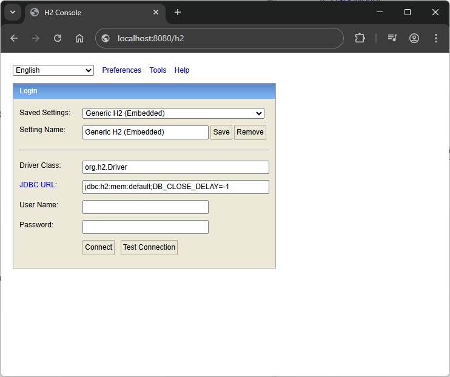
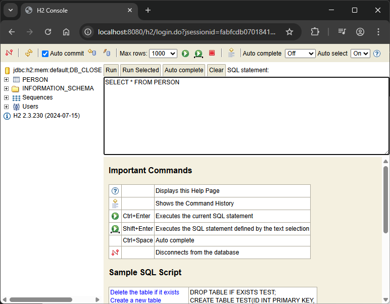
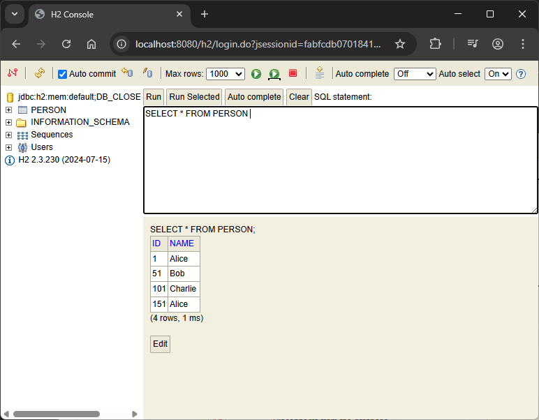
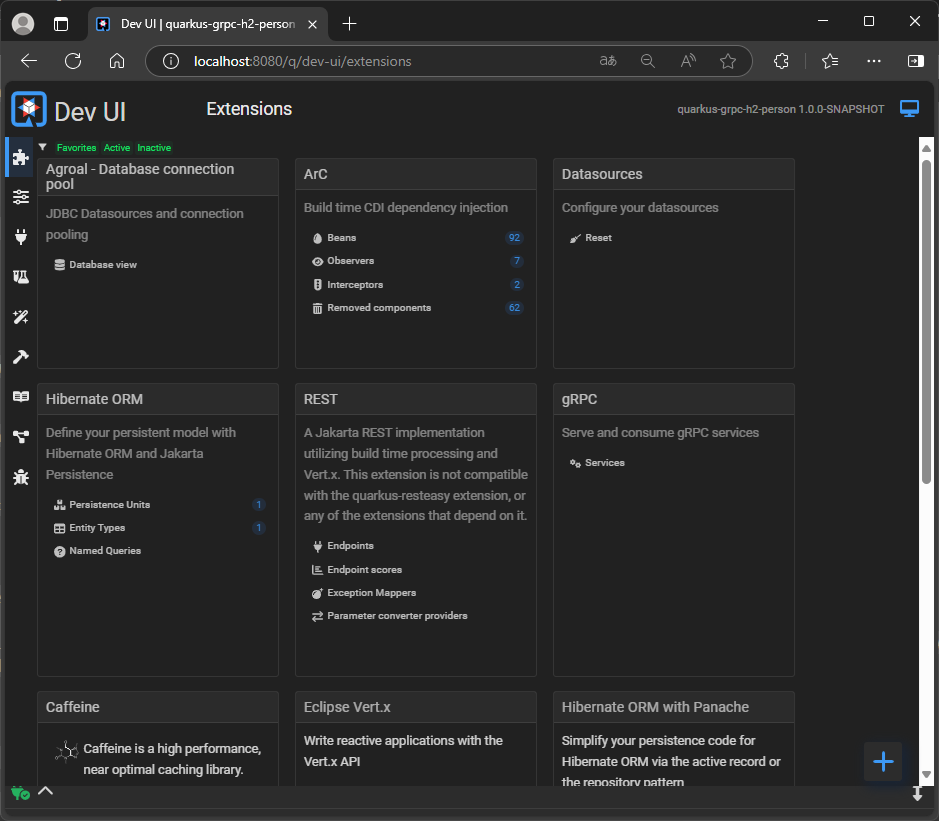
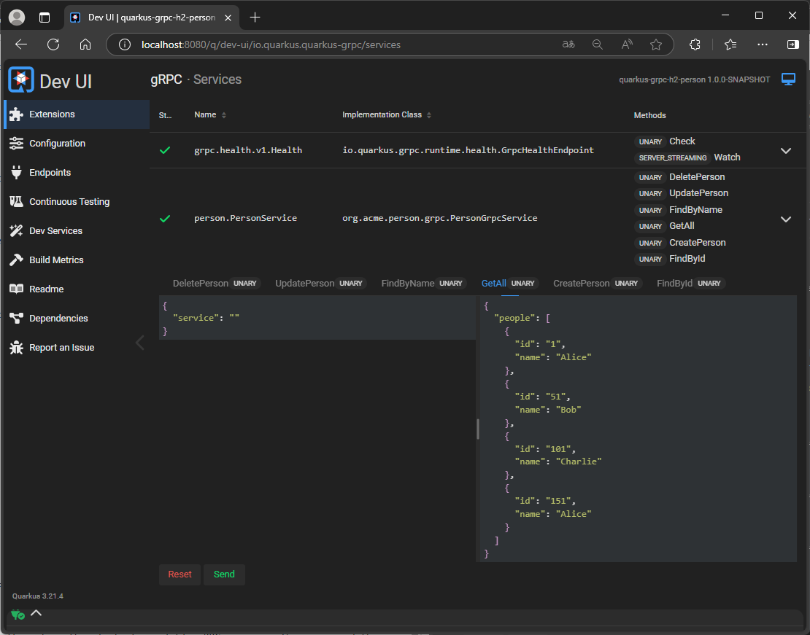

# Person (gRPC, Quarkus, H2)

Build a Quarkus application exposing a gRPC service to interact with a `Person` entity stored in an H2 in-memory database. We'll implement `findById`, `findByName`, `getAll` and more operations as well as full CRUD (Create, Read, Update, Delete) operations for the `Person` entity via gRPC.

* [Quarkus](#quarkus)
* [H2 Database](#h2-database)
* [Dev-ui](#dev-ui)    

---

## Quarkus

**Step 1: Create Quarkus Project**

Open a terminal and run the following command (using Maven):

```bash
mvn io.quarkus.platform:quarkus-maven-plugin:3.12.2:create \
    -DprojectGroupId=org.acme \
    -DprojectArtifactId=quarkus-grpc-h2-person \
    -Dextensions="grpc, resteasy-reactive, hibernate-orm-panache, jdbc-h2"
cd quarkus-grpc-h2-person
```

*   `grpc`: Adds gRPC server and client support.
*   `resteasy-reactive`: Included by default, gives us basic HTTP support (though we primarily focus on gRPC).
*   `hibernate-orm-panache`: Simplifies database interactions with JPA using the Active Record or Repository pattern. We'll use Active Record here.
*   `jdbc-h2`: Adds the H2 database driver.

---

**Step 2: Define the Data Model (JPA Entity)**

Create a Java class representing the `Person` entity.

`src/main/java/org/acme/person/model/Person.java`:

```java
package org.acme.person.model;

import io.quarkus.hibernate.orm.panache.PanacheEntity;
import jakarta.persistence.Entity;
import jakarta.persistence.Column;

@Entity
public class Person extends PanacheEntity { // PanacheEntity provides Long id field

    @Column(nullable = false)
    public String name;

    // Optional: Add more fields like age, email etc. if needed

    // Default constructor required by JPA
    public Person() {
    }

    // Convenience constructor
    public Person(String name) {
        this.name = name;
    }

    // Panache provides basic finders like findById, list, listAll etc.
    // We can add custom finders here if needed, e.g.:
    public static java.util.List<Person> findByName(String name) {
        return list("name", name);
    }
}
```

---

**Step 3: Define the gRPC Service Contract (`.proto`)**

Create the protocol buffer definition file. This defines the service, methods, and message structures.

Create the directory `src/main/proto`.

`src/main/proto/person.proto`:

```protobuf
syntax = "proto3"; // Specify proto3 syntax

package person; // Package name used in generated code

// Define options for Java code generation
option java_package = "org.acme.person.grpc";
option java_multiple_files = true; // Generate each message/service in its own file

// The service definition with CRUD operations
service PersonService {
  // --- Create ---
  // Creates a new person
  rpc CreatePerson (CreatePersonRequest) returns (PersonResponse); // Return the created person with ID

  // --- Read ---
  // Finds a person by their ID
  rpc FindById (PersonByIdRequest) returns (PersonResponse);
  // Finds people by their name (can return multiple)
  rpc FindByName (PersonByNameRequest) returns (PeopleResponse);
  // Gets all people
  rpc GetAll (GetAllPeopleRequest) returns (PeopleResponse);

  // --- Update ---
  // Updates an existing person
  rpc UpdatePerson (UpdatePersonRequest) returns (PersonResponse); // Return the updated person

  // --- Delete ---
  // Deletes a person by their ID
  rpc DeletePerson (DeletePersonRequest) returns (DeletePersonResponse); // Return success status
}

// --- Message Structures ---

// Message structure for a Person
message Person {
  int64 id = 1;
  string name = 2;
}

// --- Create Messages ---
message CreatePersonRequest {
  string name = 1; // Only need name to create
}

// --- Read Messages ---
message PersonByIdRequest {
  int64 id = 1;
}

message PersonByNameRequest {
  string name = 1;
}

message GetAllPeopleRequest {} // Empty request

// --- Update Messages ---
message UpdatePersonRequest {
  int64 id = 1;   // ID of the person to update
  string name = 2; // New name for the person
}

// --- Delete Messages ---
message DeletePersonRequest {
  int64 id = 1; // ID of the person to delete
}

// --- Response Messages ---

// Response containing a single Person (optional for not found / create/update result)
message PersonResponse {
  optional Person person = 1; // Use optional to handle not found cases or return created/updated entity
}

// Response containing a list of people
message PeopleResponse {
  repeated Person people = 1;
}

// Response for the delete operation
message DeletePersonResponse {
  bool success = 1; // Indicates if the deletion was successful
}
```
**Changes:**

*   Added `CreatePerson` RPC with `CreatePersonRequest`.
*   Added `UpdatePerson` RPC with `UpdatePersonRequest`.
*   Added `DeletePerson` RPC with `DeletePersonRequest` and `DeletePersonResponse`.
*   Updated comments to reflect CRUD structure.
*   Kept existing Read operations. `PersonResponse` is reused for Create and Update results.

---

**Step 4: Generate gRPC Code**

Quarkus automatically handles gRPC code generation during the build process (e.g., when we compile or run in dev mode). We can trigger it manually if needed:

```bash
mvn compile
```

This will generate Java source files based on `person.proto` in the `target/generated-sources/protobuf` directory. We don't usually need to interact with these directly, but it's good to know they exist.

---

**Step 5: Implement the gRPC Service Logic**

Create the Java class that implements the service defined in the `.proto` file. Quarkus gRPC uses Mutiny (a reactive programming library) for handling asynchronous operations.

`src/main/java/org/acme/person/grpc/PersonGrpcService.java`:

```java
package org.acme.person.grpc;

import io.quarkus.grpc.GrpcService;
import io.smallrye.mutiny.Uni;
import jakarta.enterprise.context.ApplicationScoped; // Use ApplicationScoped
import jakarta.inject.Singleton;
import jakarta.transaction.Transactional;
import org.acme.person.model.Person;
import org.jboss.logging.Logger;

import java.util.List;
import java.util.stream.Collectors;

@GrpcService // Register this class as a gRPC service endpoint
//@ApplicationScoped // Services are typically ApplicationScoped
@Singleton
public class PersonGrpcService implements PersonService { // Implements generated service interface

    private static final Logger log = Logger.getLogger(PersonGrpcService.class);

    // --- Create ---
    @Override
    @Transactional // Required for database writes
    public Uni<PersonResponse> createPerson(CreatePersonRequest request) {
        log.infof("Received createPerson request for name: %s", request.getName());
        if (request.getName() == null || request.getName().trim().isEmpty()) {
            // Basic validation - gRPC typically uses status codes for errors
            // For simplicity, we'll return an empty response here, but proper error handling is better
            log.warn("Cannot create person with empty name");
            // We could throw an exception mapped to a gRPC status code
            // throw new StatusRuntimeException(Status.INVALID_ARGUMENT.withDescription("Name cannot be empty"));
            return Uni.createFrom().item(PersonResponse.newBuilder().build());
        }

        return Uni.createFrom().item(() -> {
                    Person newPerson = new Person(request.getName());
                    newPerson.persist(); // Persist the new entity
                    log.infof("Created person with ID: %d", newPerson.id);
                    return newPerson; // Return the persisted entity (with ID)
                })
                .map(persistedPerson -> PersonResponse.newBuilder()
                        .setPerson(toProtoPerson(persistedPerson))
                        .build());
    }

    // --- Read Methods (Unchanged from previous example) ---

    @Override
    @Transactional // Good practice for consistency
    public Uni<PersonResponse> findById(PersonByIdRequest request) {
        log.infof("Received findById request for id: %d", request.getId());
        return Uni.createFrom().item(() -> Person.<Person>findById(request.getId()))
                .map(personEntity -> {
                    PersonResponse.Builder responseBuilder = PersonResponse.newBuilder();
                    if (personEntity != null) {
                        responseBuilder.setPerson(toProtoPerson(personEntity));
                    }
                    return responseBuilder.build();
                });
    }

    @Override
    @Transactional
    public Uni<PeopleResponse> findByName(PersonByNameRequest request) {
        log.infof("Received findByName request for name: %s", request.getName());
        return Uni.createFrom().item(() -> Person.findByName(request.getName()))
                .map(personList -> PeopleResponse.newBuilder()
                        .addAllPeople(personList.stream()
                                .map(this::toProtoPerson)
                                .collect(Collectors.toList()))
                        .build());
    }

    @Override
    @Transactional
    public Uni<PeopleResponse> getAll(GetAllPeopleRequest request) {
        log.info("Received getAll request");
        return Uni.createFrom().item(() -> Person.<Person>listAll())
                .map(personList -> PeopleResponse.newBuilder()
                        .addAllPeople(personList.stream()
                                .map(this::toProtoPerson)
                                .collect(Collectors.toList()))
                        .build());
    }

    // --- Update ---
    @Override
    @Transactional // Required for database writes
    public Uni<PersonResponse> updatePerson(UpdatePersonRequest request) {
        log.infof("Received updatePerson request for id: %d, new name: %s", request.getId(), request.getName());
        if (request.getName() == null || request.getName().trim().isEmpty()) {
            log.warn("Cannot update person with empty name");
            // Consider throwing StatusRuntimeException(Status.INVALID_ARGUMENT)
            return Uni.createFrom().item(PersonResponse.newBuilder().build());
        }

        return Uni.createFrom().item(() -> {
                    Person existingPerson = Person.findById(request.getId());
                    if (existingPerson != null) {
                        existingPerson.name = request.getName();
                        // No explicit persist() needed for updates on managed entities within a transaction
                        log.infof("Updated person with ID: %d", existingPerson.id);
                        return existingPerson;
                    } else {
                        log.warnf("Person with ID %d not found for update.", request.getId());
                        return null; // Indicate not found
                    }
                })
                .map(updatedPerson -> {
                    PersonResponse.Builder responseBuilder = PersonResponse.newBuilder();
                    if (updatedPerson != null) {
                        responseBuilder.setPerson(toProtoPerson(updatedPerson));
                    }
                    // If updatedPerson is null (not found), response will be empty (no person field)
                    return responseBuilder.build();
                });
    }

    // --- Delete ---
    @Override
    @Transactional // Required for database writes
    public Uni<DeletePersonResponse> deletePerson(DeletePersonRequest request) {
        log.infof("Received deletePerson request for id: %d", request.getId());
        return Uni.createFrom().item(() -> Person.deleteById(request.getId())) // deleteById returns boolean
                .map(deleted -> {
                    if (deleted) {
                        log.infof("Deleted person with ID: %d", request.getId());
                    } else {
                        log.warnf("Person with ID %d not found for deletion.", request.getId());
                    }
                    return DeletePersonResponse.newBuilder().setSuccess(deleted).build();
                });
    }


    // --- Helper method (Unchanged) ---
    private org.acme.person.grpc.Person toProtoPerson(org.acme.person.model.Person entity) {
        if (entity == null) {
            return null;
        }
        return org.acme.person.grpc.Person.newBuilder()
                .setId(entity.id)
                .setName(entity.name)
                .build();
    }
}
```

**Explanation:**

*   `@GrpcService`: Tells Quarkus this class implements a gRPC service.
*   `implements PersonService`: Implements the interface generated from our `.proto` file (using Mutiny types like `Uni`).
*   `@Transactional`: Ensures database operations run within a transaction. Crucial for writes, good practice for reads.
*   `Uni<T>`: Represents a result that will arrive asynchronously. Panache reactive methods often return `Uni` or `Multi`. We use `Uni.createFrom().item(...)` or `.map(...)` to wrap our synchronous Panache calls (like `findById`, `listAll`, `findByName`) into the required `Uni` type.
*   `PanacheEntity` methods: We use `Person.findById()`, `Person.findByName()`, `Person.listAll()` provided by Panache.
*   Mapping: We convert the JPA `Person` entity to the gRPC `Person` message using helper methods. Note the distinction between the two.
*   `optional Person` in `PersonResponse`: We use `optional` in proto3 and check for `null` entity in `findById` to represent "not found" without throwing an error. The response will contain the `person` field only if an entity was found.

**Changes:**

*   Implemented `createPerson`, `updatePerson`, and `deletePerson`.
*   Added `@Transactional` to Create, Update, Delete methods as they modify the database.
*   Used `Person.persist()` for creating new entities.
*   For updates, we find the entity, modify its fields, and rely on Hibernate's dirty checking within the transaction to persist changes.
*   Used `Person.deleteById()` which returns a boolean indicating success.
*   Added basic logging for each operation.
*   Included simple validation checks (e.g., non-empty name for create/update) and demonstrated where more robust gRPC error handling (like `StatusRuntimeException`) could be added.

---

**Step 6: Configure H2 Database and Hibernate**

Modify the `application.properties` file to configure the H2 in-memory database and Hibernate.

`src/main/resources/application.properties`:

```properties
# Quarkus gRPC Server configuration (default port is 9000)
quarkus.grpc.server.port=9000
# quarkus.grpc.server.use-separate-server=true # Default is true, gRPC runs on its own port
# If we wanted gRPC on the main HTTP port (default 8080):
# quarkus.grpc.server.use-separate-server=false
# quarkus.http.port=8080

# H2 Datasource Configuration (In-Memory)
quarkus.datasource.db-kind=h2
quarkus.datasource.jdbc.url=jdbc:h2:mem:default;DB_CLOSE_DELAY=-1
# quarkus.datasource.username=sa       # Optional for H2 mem default
# quarkus.datasource.password=sa       # Optional for H2 mem default

# Hibernate ORM Configuration
# Drop and re-create the database schema on startup (good for development)
quarkus.hibernate-orm.database.generation=drop-and-create
# Log SQL statements (useful for debugging)
quarkus.hibernate-orm.log.sql=true
quarkus.hibernate-orm.sql-load-script=import.sql # Optional Load initial data

# Optional: Pretty print JSON logs if needed
# quarkus.log.console.json=false
```

*   `quarkus.grpc.server.port=9000`: Sets the dedicated port for the gRPC server.
*   `jdbc:h2:mem:default`: Configures H2 to run in memory. `DB_CLOSE_DELAY=-1` keeps the DB alive as long as the JVM runs.
*   `drop-and-create`: Tells Hibernate to drop the existing schema (if any) and create a new one based on our entities every time the application starts.
*   `log.sql=true`: Shows the SQL Hibernate executes in the console.
*   `import.sql`: We'll use this to add some initial data.

---

**Step 7: Add Initial Data (Optional)**

Create an `import.sql` file in `src/main/resources` to preload some data into the H2 database when the application starts. Hibernate will automatically pick up this file because of the `drop-and-create` setting.

`src/main/resources/import.sql`:

```sql
-- Hibernate needs the sequence to be updated if IDs are manually inserted
-- The sequence name is typically entityname_seq
INSERT INTO Person(id, name) VALUES (nextval('Person_seq'), 'Alice');
INSERT INTO Person(id, name) VALUES (nextval('Person_seq'), 'Bob');
INSERT INTO Person(id, name) VALUES (nextval('Person_seq'), 'Charlie');
INSERT INTO Person(id, name) VALUES (nextval('Person_seq'), 'Alice'); -- Another Alice for FindByName test

-- Make sure the sequence is updated past the highest manually inserted ID if needed
-- SELECT setval('Person_seq', (SELECT MAX(id) FROM Person)); -- This syntax might vary slightly based on H2/DB version
-- Using nextval generally handles this correctly.
```

*Note:* The sequence name (`Person_seq`) is derived from the entity name. If we have issues, check the Hibernate logs during startup to see the exact sequence name it creates.

---

**Step 8: Run the Application**

Start the Quarkus application in development mode:

```bash
mvn quarkus:dev
```

We should see logs indicating:
*   Quarkus starting.
*   The gRPC server listening on port 9000.
*   Hibernate creating tables based on the `Person` entity.
*   Hibernate executing the `import.sql` script.
*   SQL logs if `quarkus.hibernate-orm.log.sql=true`.

---

**Step 9: Test the gRPC Service**

Use a gRPC client like `grpcurl` to interact with our service. Open a *new* terminal window.

1.  **List Services:**
    ```bash
    grpcurl -plaintext localhost:9000 list
    ```
    Output should include `person.PersonService`.

2.  **Describe Service:**
    ```bash
    grpcurl -plaintext localhost:9000 describe person.PersonService
    ```
    This shows the available RPC methods and their request/response types.

3.  **Test FindById (Existing ID):**
    ```bash
    grpcurl -plaintext -d '{"id": 1}' localhost:9000 person.PersonService/FindById
    ```
    Output (should find Alice, assuming ID 1):
    ```json
    {
      "person": {
        "id": "1",
        "name": "Alice"
      }
    }
    ```
    *(Note: `grpcurl` often shows int64 as strings in JSON)*

4.  **Test FindById (Non-Existing ID):**
    ```bash
    grpcurl -plaintext -d '{"id": 999}' localhost:9000 person.PersonService/FindById
    ```
    Output (should be empty, as the `optional person` field is not set):
    ```json
    {}
    ```

5.  **Test FindByName:**
    ```bash
    grpcurl -plaintext -d '{"name": "Alice"}' localhost:9000 person.PersonService/FindByName
    ```
    Output (should find both Alices):
    ```json
    {
      "people": [
        {
          "id": "1",
          "name": "Alice"
        },
        {
          "id": "4",
          "name": "Alice"
        }
      ]
    }
    ```

6.  **Test FindByName (Non-Existing Name):**
    ```bash
    grpcurl -plaintext -d '{"name": "Zoe"}' localhost:9000 person.PersonService/FindByName
    ```
    Output (empty list):
    ```json
    {
      "people": []
    }
    ```

7.  **Test GetAll:**
    ```bash
    grpcurl -plaintext localhost:9000 person.PersonService/GetAll
    ```
    Output (should list all people from `import.sql`):
    ```json
    {
      "people": [
        {
          "id": "1",
          "name": "Alice"
        },
        {
          "id": "2",
          "name": "Bob"
        },
        {
          "id": "3",
          "name": "Charlie"
        },
        {
          "id": "4",
          "name": "Alice"
        }
      ]
    }
    ```

We now have a working Quarkus gRPC service interacting with an H2 database using Hibernate Panache!

---

**Step 10: Test the CRUD Operations**

Use `grpcurl` in a new terminal.

1.  **List/Describe (Verify new methods exist):**
    ```bash
    grpcurl -plaintext localhost:9000 list
    ```
    ```bash
    grpcurl -plaintext localhost:9000 describe person.PersonService
    ```
    We should see `CreatePerson`, `UpdatePerson`, `DeletePerson` listed.

2.  **GetAll (Check initial state):**
    ```bash
    grpcurl -plaintext localhost:9000 person.PersonService/GetAll
    ```
    *(Should show Alice, Bob, Charlie, Alice - IDs might be 1, 2, 3, 4)*

3.  **CreatePerson:**
    ```bash
    grpcurl -plaintext -d '{"name": "David"}' localhost:9000 person.PersonService/CreatePerson
    ```
    Output (should show the newly created David with a generated ID, likely 5):
    ```json
    {
      "person": {
        "id": "5", // Assuming next ID is 5
        "name": "David"
      }
    }
    ```

4.  **GetAll (Verify creation):**
    ```bash
    grpcurl -plaintext localhost:9000 person.PersonService/GetAll
    ```
    *(Should now include David)*

5.  **FindById (Verify David):**
    ```bash
    grpcurl -plaintext -d '{"id": 5}' localhost:9000 person.PersonService/FindById
    ```
    *(Should return David)*

6.  **UpdatePerson (Update David to Dave):**
    ```bash
    grpcurl -plaintext -d '{"id": 5, "name": "Dave"}' localhost:9000 person.PersonService/UpdatePerson
    ```
    Output:
    ```json
    {
      "person": {
        "id": "5",
        "name": "Dave"
      }
    }
    ```

7.  **FindById (Verify Update):**
    ```bash
    grpcurl -plaintext -d '{"id": 5}' localhost:9000 person.PersonService/FindById
    ```
    Output:
    ```json
    {
      "person": {
        "id": "5",
        "name": "Dave"
      }
    }
    ```

8.  **UpdatePerson (Non-existent ID):**
    ```bash
    grpcurl -plaintext -d '{"id": 999, "name": "Nobody"}' localhost:9000 person.PersonService/UpdatePerson
    ```
    Output (should be empty as the person wasn't found):
    ```json
    {}
    ```

9.  **DeletePerson (Delete Dave):**
    ```bash
    grpcurl -plaintext -d '{"id": 5}' localhost:9000 person.PersonService/DeletePerson
    ```
    Output:
    ```json
    {
      "success": true
    }
    ```

10. **GetAll (Verify deletion):**
    ```bash
    grpcurl -plaintext localhost:9000 person.PersonService/GetAll
    ```
    *(Should no longer include Dave/David)*

11. **FindById (Verify deletion again):**
    ```bash
    grpcurl -plaintext -d '{"id": 5}' localhost:9000 person.PersonService/FindById
    ```
    Output (empty response):
    ```json
    {}
    ```

12. **DeletePerson (Non-existent ID):**
    ```bash
    grpcurl -plaintext -d '{"id": 5}' localhost:9000 person.PersonService/DeletePerson
    ```
    Output:
    ```json
    {
      "success": false // Already deleted or never existed
    }
    ```

---

We now have a complete CRUD gRPC service for the `Person` entity, backed by an H2 database and implemented using Quarkus, Panache, and Mutiny.

---
## H2 Database

Go to `http://localhost:8080/h2`



and `click to connet`.



Then click on `PERSON` table and `Run` the SQL command.



---

## Dev-ui

Under `http://localhost:8080/q/dev-ui` we can find the gRPC `services`,



if we goto the `services` it will redirected to the site with a list of available gRPC services. We can expand the row by clicking on `person.PersonService`. Here we choose `GetAll` tab and click on `send` button.


---"# quarkus-grpc-h2-person" 
